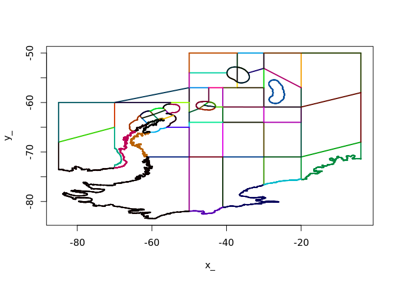

WIP
---

Raw extraction scripts that produce various intermediate cache outputs.
Each of these take some time to run, hence the cache-as-we go approach:

-   modis.R for chlorophyll-a
-   oisst.R for sea surface temperature
-   nsidc.R for sea ice
-   currents.R for surface flux

Those raw extractions are then summarized appropriately for each
variable. We can group sst, chlorophll-a, and ice-quantiles together as
each are bulk properties identified by date and polygon. The current
flux is a pairwise variable, and so is stored separately.

Extraction summaries are detailed in ‘Summary\_ds.R’, producing the
final (currently in draft) output tables in R’s binary serialization
format “.rds”. (These files contain a single data frame and can be read
with the `readRDS()` function).

Data extraction
---------------

Area 48 Small-Scale Management Unit (SSMU), mean total chlorophyll, mean
temperature, mean coverage of sea ice (&lt;20%, 20-50%, 50-75%, 75-95%,
&gt;95%), surface area of water crossing the boundaries of the SSMUs.

We include the ‘KD490’ “Diffuse attenuation coefficient at 490 nm, KD2
algorithm”, which is “m^-1” to integrate carbon from the chlorophyll-a
over depth.

Regions
-------

Area 48 SSMUs manually cleaned using Manifold GIS to ensure topological
sense for all boundaries. The regions are stored in ‘sf’ simple features
format, a data frame of SSMU properties and geometry.

    x <- readRDS("shapes/Area_48_Krill_Domain.rds")
    x$poly <- 1:nrow(x)
    library(sf)
    plot(x["poly"])

    dim(x)

    ## [1] 41 16

    print(x)

    ## Simple feature collection with 41 features and 15 fields
    ## geometry type:  POLYGON
    ## dimension:      XY
    ## bbox:           xmin: -85 ymin: -83.4677 xmax: -3.938376 ymax: -50
    ## epsg (SRID):    4326
    ## proj4string:    +proj=longlat +datum=WGS84 +no_defs
    ## First 10 features:
    ##      ID GAR_ID Name ShortLabel LongLabel StartDate EndDate Descr Reference
    ## 1  9857      0   NA          2        NA        NA      NA    NA        NA
    ## 2  9858      0   NA          1        NA        NA      NA    NA        NA
    ## 3  9859      0   NA         14        NA        NA      NA    NA        NA
    ## 4  9860      0   NA         39        NA        NA      NA    NA        NA
    ## 5  9861      0   NA         40        NA        NA      NA    NA        NA
    ## 6  9862      0   NA         37        NA        NA      NA    NA        NA
    ## 7  9863      0   NA         38        NA        NA      NA    NA        NA
    ## 8  9864      0   NA         32        NA        NA      NA    NA        NA
    ## 9  9865      0   NA         31        NA        NA      NA    NA        NA
    ## 10 9866      0   NA         41        NA        NA      NA    NA        NA
    ##    ParentID CreatedBy CreatedOn ModifiedBy ModifiedOn
    ## 1         0        NA        NA         NA         NA
    ## 2         0        NA        NA         NA         NA
    ## 3         0        NA        NA         NA         NA
    ## 4         0        NA        NA         NA         NA
    ## 5         0        NA        NA         NA         NA
    ## 6         0        NA        NA         NA         NA
    ## 7         0        NA        NA         NA         NA
    ## 8         0        NA        NA         NA         NA
    ## 9         0        NA        NA         NA         NA
    ## 10        0        NA        NA         NA         NA
    ##                          geometry poly
    ## 1  POLYGON ((-85 -73.52015, -8...    1
    ## 2  POLYGON ((-85 -68, -70 -65,...    2
    ## 3  POLYGON ((-70 -60, -55 -60,...    3
    ## 4  POLYGON ((-20 -60.91173, -4...    4
    ## 5  POLYGON ((-20.00001 -71, -4...    5
    ## 6  POLYGON ((-30 -71, -20.0000...    6
    ## 7  POLYGON ((-30 -76.60041, -2...    7
    ## 8  POLYGON ((-40.99999 -71, -4...    8
    ## 9  POLYGON ((-41 -64, -40.9999...    9
    ## 10 POLYGON ((-20.00001 -71, -2...   10

We store the row number ‘poly’ as a polygon feature identifier, used in
all data tables below.

TODO: find shared boundary lengths between pairs of polygons:

    arc <- silicate::ARC(x)
    plot(arc)

Chlorophyll-a and SST
---------------------

Chlorophyll-a based on the Johnson 2013 algorith was calculated for
daily L3bin RRS products for the MODISA product. These values are then
aggregated into polygon averages on a monthly basis.

The mean chlorophyll-a as well as the number of bins used is recorded.

The KD490 “Diffuse attenuation coefficient at 490 nm, KD2 algorithm,
m^-1” is also included from the monthly L3mapped products.

Sea surface temperature from the monthly Optimally Interpolated Sea
Surface Temperature product provided by NOAA.

    chl_sst <- readRDS("chl_sst.rds")
    chl_sst

    ## # A tibble: 18,614 x 7
    ##     poly    sst sst_n date        chla nbins    kd
    ##    <dbl>  <dbl> <int> <date>     <dbl> <int> <dbl>
    ##  1     1 -1.19    109 1981-12-15    NA    NA    NA
    ##  2     2  1.89     99 1981-12-15    NA    NA    NA
    ##  3     3  0.904    30 1981-12-15    NA    NA    NA
    ##  4     4  0.502   151 1981-12-15    NA    NA    NA
    ##  5     5 -1.09    161 1981-12-15    NA    NA    NA
    ##  6     6 -1.01     70 1981-12-15    NA    NA    NA
    ##  7     7 -1.30     49 1981-12-15    NA    NA    NA
    ##  8     8 -1.62     97 1981-12-15    NA    NA    NA
    ##  9     9 -0.669    77 1981-12-15    NA    NA    NA
    ## 10    10 -1.18     47 1981-12-15    NA    NA    NA
    ## # … with 18,604 more rows

Sea ice
-------

Sea ice is quantiled area covered with percentage classes (&lt;20%,
20-50%, 50-75%, 75-95%, &gt;95%), from the NSIDC 25km polar monthly
average product.

Values are km^2. Note that all pixels in the sea ice product have been
used, and assumed to have constant area at 25km^2. If the polygons
overlaid pixels that are consided to be land or otherwise missing by the
product they are set to 0 and the are was included.

    ice <- readRDS("ice_area.rds")
    ice

    ## # A tibble: 19,803 x 7
    ##     poly date        ice_20 ice_50 ice_75 ice_95 ice_100
    ##    <int> <date>       <dbl>  <dbl>  <dbl>  <dbl>   <dbl>
    ##  1     1 1978-10-15  106250   4375  53750 300000    1875
    ##  2     2 1978-10-15  484375  33750  30000  23750      NA
    ##  3     3 1978-10-15  210000     NA     NA     NA      NA
    ##  4     4 1978-10-15 1008125 115000  36875     NA      NA
    ##  5     5 1978-10-15      NA  27500 203125 666875      NA
    ##  6     6 1978-10-15      NA     NA  53125 286250      NA
    ##  7     7 1978-10-15   25625     NA  20000 108125   20000
    ##  8     8 1978-10-15   54375     NA     NA 198125   36250
    ##  9     9 1978-10-15      NA     NA  11875 362500      NA
    ## 10    10 1978-10-15   65000     NA  11250 110000    8125
    ## # … with 19,793 more rows

Flux
----

Boundary flux is calculated from altimetry data products of surface
currents, these are daily remote sensing grids of meridional (U) and
zonal (V) components of velocity in m/s-1. The global grids are
processed into [polar grid
form](https://github.com/AustralianAntarcticDivision/raad-deriv#polar-currents).
Cell values (U and V in m/s-1) that lie on polygon boundaries are
extracted and summarized in terms of source and target polygon.

Pairs are polygon neighbours, the row-index of the regions above. We
calculate the *sum of flux magnitude* between polygons.

    flux <- readRDS("flux_pairs.rds")
    flux

    ## # A tibble: 578,937 x 4
    ##      src   tar   flux date               
    ##    <dbl> <dbl>  <dbl> <dttm>             
    ##  1     2     1  5908. 1993-01-01 00:00:00
    ##  2     3    20 35404. 1993-01-01 00:00:00
    ##  3     4     5 64758. 1993-01-01 00:00:00
    ##  4     4    26  5874. 1993-01-01 00:00:00
    ##  5     5     4 14374. 1993-01-01 00:00:00
    ##  6     5    10 17182. 1993-01-01 00:00:00
    ##  7     6     7 21577. 1993-01-01 00:00:00
    ##  8     6     9  6617. 1993-01-01 00:00:00
    ##  9     7     8 51845. 1993-01-01 00:00:00
    ## 10     8     7 26902. 1993-01-01 00:00:00
    ## # … with 578,927 more rows

Boundary lengths
----------------

The shared boundary lengths between polygons are found by

-   decomposing polygons to edges (using `silicate::SC`)
-   calculating every edge length (in metres, assuming rhumb distance of
    constant bearing)
-   grouping lengths by object pairs, and sum

`object1` and `object1` are the row index of the regions data frame (`x`
above)

    boundaries <- readRDS("shared_boundary_lengths.rds")
    boundaries

    ## # A tibble: 81 x 3
    ##    object1 object2 distance
    ##      <int>   <int>    <dbl>
    ##  1      26      27  345090.
    ##  2      16      21   87115.
    ##  3      16      22  146988.
    ##  4      16      19  197758.
    ##  5      16      17  132212.
    ##  6      13      14  409937.
    ##  7      18      23   61423.
    ##  8      18      20  190859.
    ##  9      18      19   92748.
    ## 10      28      31  335016.
    ## # … with 71 more rows
